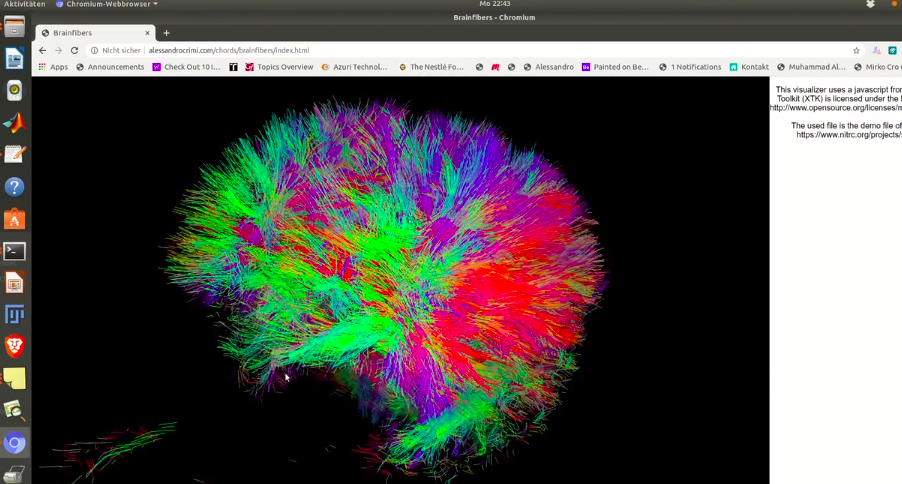

# tracktools
Collection of scripts useful for tracks manipulation, HTML loading, 3D printing

Welcome to tracktools!
These are a files in Matlab and Javascript to do few useful things with your tractography. The current plan is a total porting on Python.

the html_visualizer uses a javascript (xtk.js) developed by XTK to allow you to insert your tractography in your website:

the TransTrk2Vtk.m file allows you to convert trk files into VTK.

UPCOMING: TRK to STL for 3D printing. Unfortunally, you canno just convert VTK files into STL for 3D printing or Augmented Reality as fiber bundles are not converted directly into surface.

The TRK reader and writer were originally developed by John Colby, UCLA Developmental Cognitive Neuroimaging Group (Sowell Lab)

if you use the overall toolbox please cite
Crimi, Alessandro, Luca Giancardo, Fabio Sambataro, Alessandro Gozzi, Vittorio Murino, and Diego Sona. "Multilink analysis: Brain network comparison via sparse connectivity analysis." Scientific reports 9, no. 1 (2019): 1-13.
Check the main repo: https://github.com/alecrimi/multi-link

If you use the xtg visualizer please cite 
Hähn D, Rannou N, Ahtam B, Grant PE, Pienaar R: Neuroimaging in the Browser using the X Toolkit. Front. Neuroinform. Conference 
